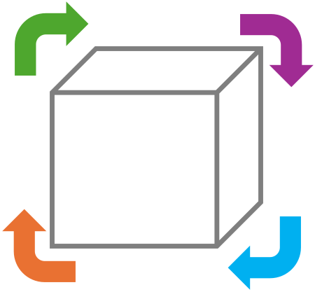

<h1>
  <picture>
    <source media="(prefers-color-scheme: dark)" srcset="docs/src/assets/logo-dark.svg">
    <source media="(prefers-color-scheme: light)" srcset="docs/src/assets/logo.svg">
    
  </picture>
  ReusePkgTemplates.jl
</h1>

[](https://bsl-support.de/julia/ReusePkgTemplates.jl/)
[](https://github.com/bslMS/ReusePkgTemplates.jl/actions/workflows/CI.yml?query=branch%3Amain)
[](https://codecov.io/gh/bslMS/ReusePkgTemplates.jl)
[](https://github.com/SciML/SciMLStyle)
[](https://github.com/bslMS/ReusePkgTemplates.jl/actions/workflows/REUSE.yml?query=branch%3Amain)

<p align="center">
  <a href="https://juliaci.github.io/PkgTemplates.jl/stable/">PkgTemplates.jl</a> ·
  <a href="https://bsl-support.de/julia/ReuseLicensing.jl/">ReuseLicensing.jl</a> ·
  <a href="https://reuse.software/">REUSE</a> ·
  <a href="https://github.com/bslMS/ReusePkgTemplates.jl/issues">Issues</a> ·
  <a href="https://codeberg.org/bslMS/ReusePkgTemplates.jl">Codeberg mirror</a>
</p>

This repository is mirrored read-only on
[Codeberg](https://codeberg.org/bslMS/ReusePkgTemplates.jl). Please use the
[GitHub repository](https://github.com/bslMS/ReusePkgTemplates.jl) for issues,
pull requests, and releases.

ReusePkgTemplates.jl provides a small convenience layer on top of PkgTemplates.jl
for generating Julia package scaffolds with REUSE/SPDX licensing metadata. Generated
packages include file-level copyright and licensing metadata, together with
an outbound package-level license declaration in the root `LICENSE` file.

The package keeps PkgTemplates.jl as the underlying template engine, but replaces the
conventional single-license-file workflow with REUSE-oriented project generation. It is
meant for package authors who need machine-readable file-level licensing, multiple
license classes for code, documentation, and infrastructure, and a clearer distinction
between package-level and file-level licensing.

This package is under active development, and public APIs may still change.

## Installation

```julia
using Pkg
Pkg.add("ReusePkgTemplates")
```

## Usage

### Generate a REUSE-aware package

Use `with_reuse` around the PkgTemplates plugins you want to enable. It disables
PkgTemplates' conventional `License` plugin and adds REUSE-oriented files and metadata.

```julia
using ReusePkgTemplates

plugins = with_reuse(
    [
        Git(; manifest = true, ssh = true),
        GitHubActions(; x86 = true),
        Codecov()
    ];
    package_license = "EUPL-1.2+",
    docs_license = "CC-BY-4.0",
    infrastructure_license = "0BSD",
    readme_licensing_section = true
)

t = Template(;
    user = "your-github-user",
    authors = "Your Name <you@example.org>",
    dir = ".",
    plugins
)

t("MyPackage")
```

This generates a package with:

- a `LICENSE` file that contains
    - the package-level copyright notice,
    - a package license expression,
    - explanatory text,
    - the license text or texts referenced by the license expression,
- file-level license texts in `LICENSES/`,
- REUSE annotations in `REUSE.toml`,
- `Project.toml` licensing metadata,
- a README licensing section,
- a REUSE lint workflow when `GitHubActions()` is used.

By default, package-level copyright holders are derived from `authors`; pass
`copyright_holders = [...]` when the package-level holders differ.

`code_license` defaults to `package_license`, but can be set separately when source
files should carry a different file-level license expression than the outbound
package-level declaration.

### Bring your own templates

Copy the bundled ReusePkgTemplates templates into a directory, adapt the files you want
to override, and point `with_reuse` to that directory:

```julia
write_templates("reuse_templates")

plugins = with_reuse(;
    template_dir = "reuse_templates",
    package_license = "EUPL-1.2+"
)
```

Files ending in `.mustache` are rendered. Missing template files fall back to the
bundled templates.

---

For a more detailed overview, please refer to the
[documentation](https://bsl-support.de/julia/ReusePkgTemplates.jl/).

<!-- PkgTemplates: REUSE licensing section start -->
## Licensing


ReusePkgTemplates.jl is offered under the outbound package-level license expression
`EUPL-1.2+`. The authoritative package-level license declaration and copyright notice are
recorded in [`LICENSE`](LICENSE), together with the corresponding license text.

Machine-readable package-level licensing metadata is recorded in the `[reuse_licensing]`
table of [`Project.toml`](Project.toml).

The [European Union Public Licence v1.2](https://eur-lex.europa.eu/eli/dec_impl/2017/863/oj)
is available in 23 official EU language versions.

Individual files may carry separate file-level license expressions, as recorded
by their SPDX notices or by [`REUSE.toml`](REUSE.toml). This project follows the
[REUSE specification](https://reuse.software/spec/) for file-level copyright and
licensing information. License texts used for file-level REUSE licensing are
stored in [`LICENSES/`](LICENSES/).

> Recorded `Manifest.toml` files under `.licensing/manifests/`, where provided,
> document dependency resolutions considered when choosing the package-level
> license expression. They are evidence for that decision, not guarantees for
> other Julia versions, platforms, dependency resolutions, extensions, artifacts,
> load paths, or local modifications.

To verify repository-level REUSE metadata:

```bash
reuse lint
reuse spdx
```
<!-- PkgTemplates: REUSE licensing section end -->
